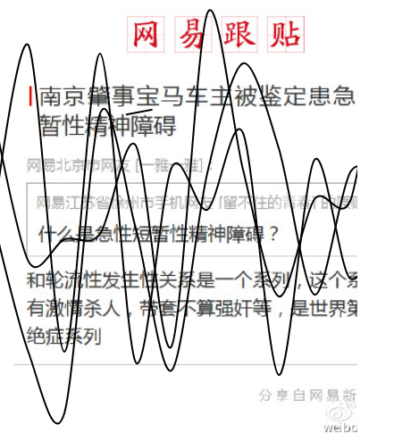
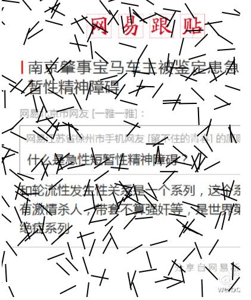
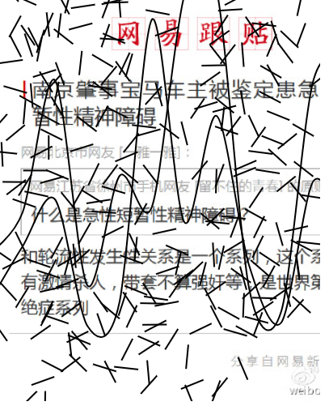
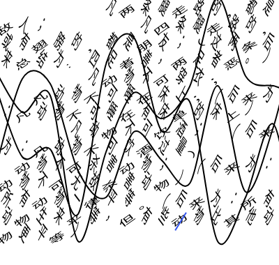
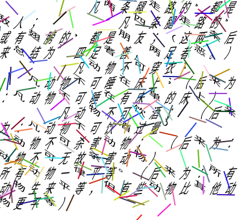

# weixinmate
微信用户的福音，所有都是单html格式，可以用来美化文字和图片

可以在PC，手机直接运行

### pics.html 效果图

### ws.html 效果图

    凡两条腿走路的，都是敌人；
    凡四条腿走路的，或有翅膀的，都是朋友；（这两条后来总结为:四足者善，两足者恶。）
    凡动物不可穿衣；
    凡动物不可睡在床上；（后来为：凡动物不可睡在有床单的床上）
    凡动物不可饮酒； （后来为：凡动物不可饮酒过量）
    动物不可杀害动物； （后来为：动物不可无故杀害动物）
    所有动物一律平等。（后来为：所有动物生来平等，但有些动物比其他动物更平等）
    

    
